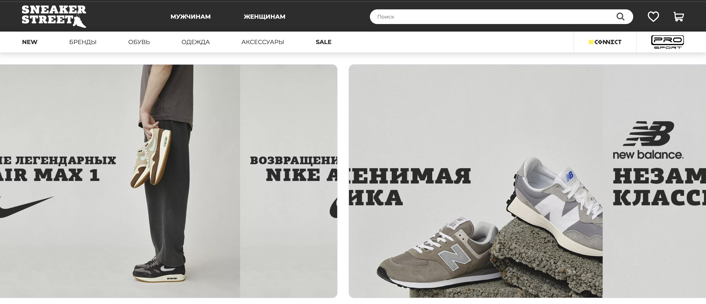
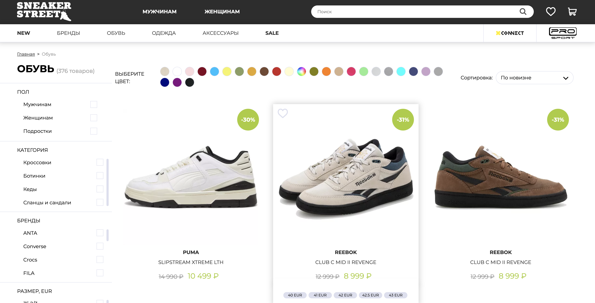

# ProjectX

# Индивидуальный проект по теме: интернет-магазин кроссовок "Skeakers"

## Sneakers

Интернет-магазин "Sneakers" предлагает широкий выбор качественной обуви для спорта и повседневной носки. Наш проект создан для того, чтобы помочь людям находить и приобретать подходящую обувь без лишних хлопот и по выгодным ценам.

## Ресурсы необходимые для использования приложения

### Для использования интернет-магазина "Sneakers" вам потребуется:

#### Установленный браузер: Google Chrome, Mozilla Firefox, Safari или Microsoft Edge.

#### Стабильное интернет-соединение.

#### Аккаунт на сайте или возможность создать его.

# Как установить программу

### Для установки приложения на устройство iOS или Android, а также для пользования сайтом, следуйте этим шагам:

#### Выберите источник установки:

#### Для установки приложения на iOS:

- Откройте App Store.

#### Для установки приложения на Android:

- Откройте Google Play Store.

#### Для доступа к сайту:

- Откройте веб-браузер и введите адрес сайта.

#### Поиск приложения или сайта:

В магазине приложений введите название приложения в строке поиска и выберите его из результатов.
Для доступа к сайту введите адрес сайта в строке поиска или используйте поисковую систему.

##### Установка приложения:

Нажмите **"Установить"** (для Android) или **"Скачать"** (для iOS) на странице приложения в магазине.

##### Дождитесь завершения загрузки и установки.

#### Доступ к сайту:

После ввода адреса сайта в строке поиска, нажмите **["Перейти"]()** или клавишу **"Enter"**
Теперь вы можете пользоваться установленным приложением или посещать сайт через веб-браузер на вашем устройстве.

# Порядок использования

## Вам нужно установить:   

Для использования сайта продажи обуви после установки, пользователь может выполнить следующие шаги

### Просмотр товаров:

После входа на сайт, пользователь может просматривать доступные товары, фильтровать их по различным критериям, таким как размер, цвет, бренд и т.д.

### Добавление товаров в корзину:

Пользователь может выбрать понравившуюся обувь и добавить её в корзину для последующей покупки.

### Оформление заказа:

После того, как пользователь добавит все необходимые товары в корзину, он может перейти к оформлению заказа, указав необходимую информацию для доставки и оплаты.

### Оплата:

Сайт предоставит пользователю различные варианты оплаты, такие как оплата банковской картой, электронным кошельком и другие.

### Отслеживание статуса заказа:

После оформления заказа, пользователь сможет отслеживать его статус через личный кабинет на сайте.

##### Дополнительную информацию о доступных опциях, командах и флагах можно найти на странице "Помощь" или "FAQ" сайта.

# Демонстрация сайта "Sneakers"

## Главная страница сайта

# Страница выбора товар

